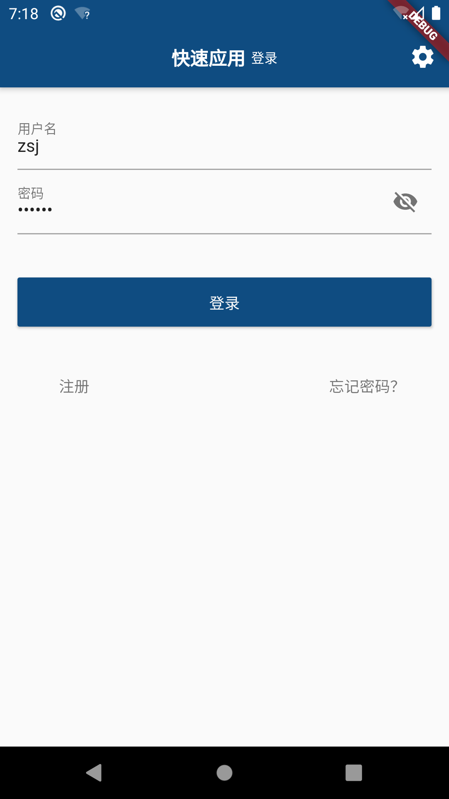
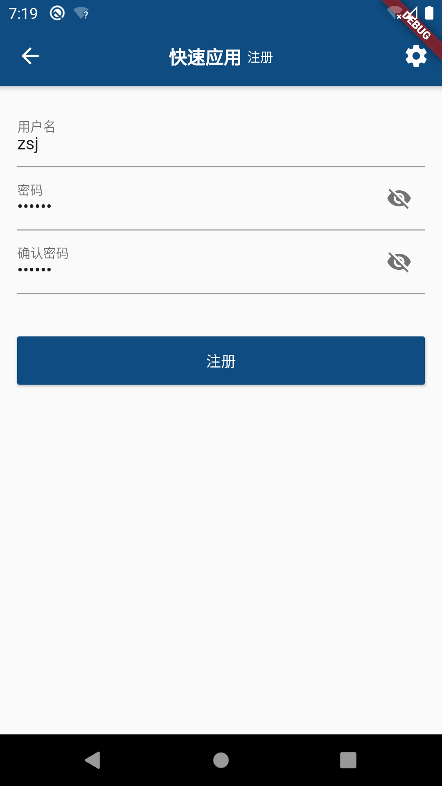
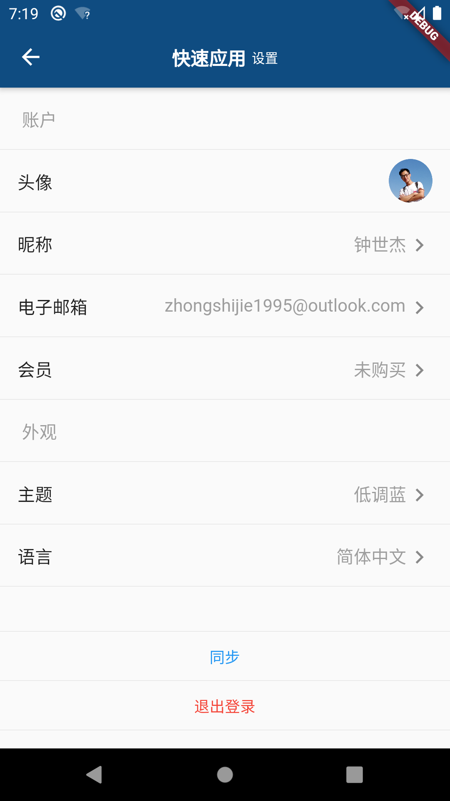
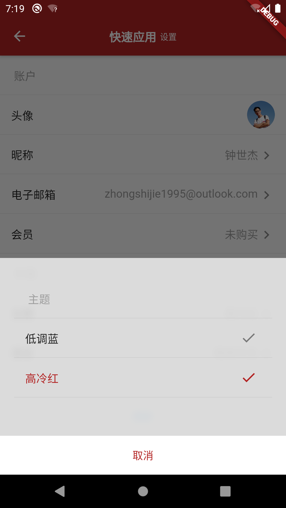
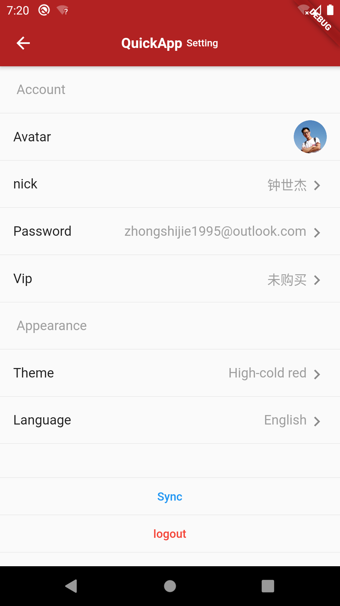
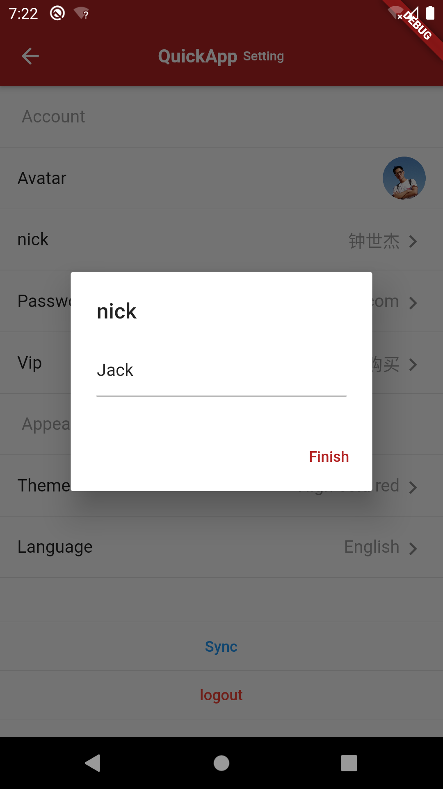
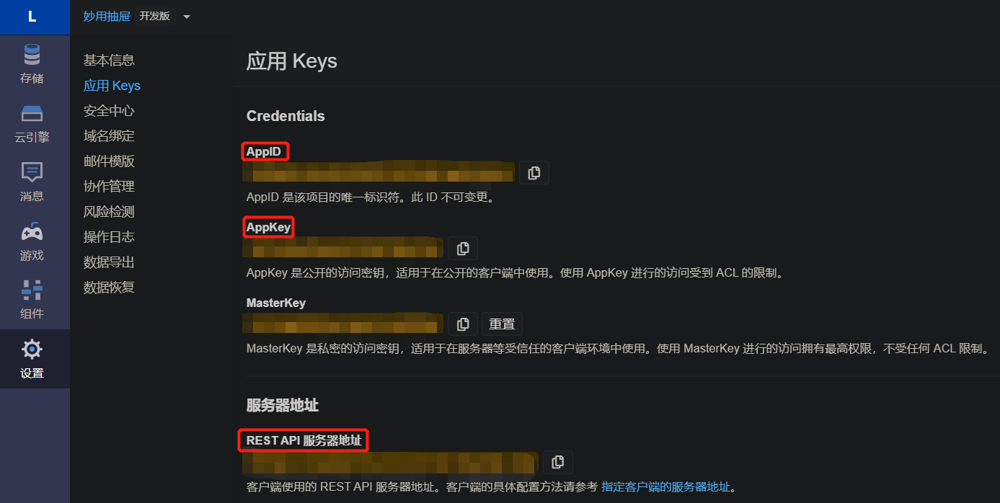
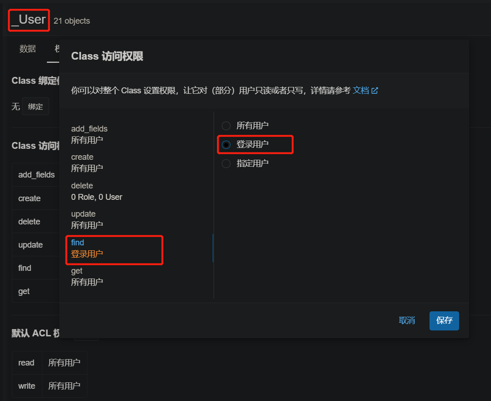

# Quick_App_User

快速APP之用户界面：助您5分钟即构建一个**跨Android、IOS**的高质量**原生APP**之**用户模块**

| | | |
|- |- |- |
| | | |
| | | |

## 实现功能

- 用户注册、用户登录
- 电子邮件重置密码
- 电子邮件校验
- 用户信息维护（头像、昵称、电子邮箱、会员）
- 热切换主题色
- 热切换多语言

## 快速上手

在开始使用该项目之前，你需要了解和掌握的预备知识：

1. 该项目为[Flutter](https://flutter.dev/)项目，可同时构建iOS和Android的原生应用。
2. 该项目预设的存储为[LeanCloud](https://www.leancloud.cn/)结构化数据。

### 配置云端存储

- 根据[LeanCloud](https://www.leancloud.cn/)要求注册应用，获得应用的`AppID`、`AppKey`和`REST API 服务器地址`，填入`./lib/comm/global_params.dart`中。

  

  ```dart
  static String appId = 'AppID';
  static String appKey = 'AppKey';
  static String serverUrl = 'REST API 服务器地址';
  ```

- 增加_User表字段
  1. `avatar` (`String`)
  2. `nick` (`String`)
  3. `vip` (`String`)

- 修改_User表权限
  

### 运行和集成

- 运行`main.dart`，进行主界面进行调试。
- 检查无问题后，将代码集成到您的项目中。
